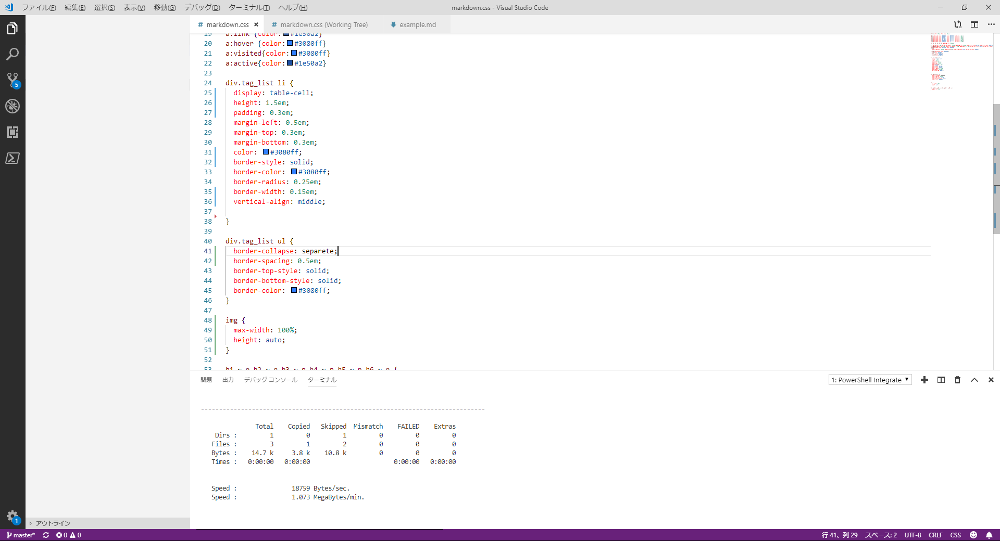

# 段落1
## 段落2
### 段落3
#### 段落4
##### 段落5
###### 段落6

てきとうな
本文を
ここに書く


-------

## 引用ブロック

> 引用ブロックです。
>
> 我思う　故に我あり
>
> > ## 引用ブロック内の段落2
> > そして入れ子の引用ブロック
>
> 元のブロックに戻る

こうやって*強調*するらしい。
アスタリスク二つでより**強い強調**、うーん頭痛が痛い。  
アンダースコア2つでも__強い強調__になる。馬から落馬した。
ならないじゃないか。

## リスト

- おにぎり
- 味噌汁
- お漬物
    - きゅうり
    - なす
    - たくあん
- 焼き魚

CSSと合わせてタグのリストっぽくする作りにしてみました。

<div class="tag_list">

* foo
* bar
* fiz
* baz
* 料理
* おにぎり

</div>

やり方はtag_listクラスを持つdivタグで囲ってあげるだけ。  
日本語と英語で高さが変わって1時間悩んだ。デザイナさんって大変。

```
<div class="tag_list">

* foo
* bar
* fizz
* bazz
* 料理
* おにぎり

</div>

```

## 大きな画像

大きな画像は縮小する。何故って？A4用紙にちゃんと印刷をしたいからです。

とあるプログラマの作業風景（スクリーンショット）



